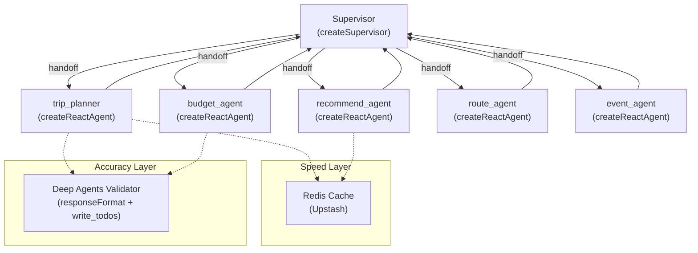

# Migrate AI Agent to [createSupervisor](file:///Users/tar/Documents/year4/nestjs-backend-taluithai/src/agent/nodes/supervisor.ts#62-187) + `createReactAgent`

Refactor the TaluiThai AI agent from a hand-rolled `StateGraph` supervisor to `@langchain/langgraph-supervisor`. Integrate **Deep Agents** for accuracy optimization and **Upstash Redis** for response speed.

## User Review Required

> [!IMPORTANT]
> **State Change**: Custom [TravelAgentState](file:///Users/tar/Documents/year4/nestjs-backend-taluithai/src/agent/state.ts#116-117) replaced by built-in `MessagesAnnotation`. **Frontend is safe** — confirmed zero dependencies on internal agent state (`planSteps`, `currentTrip`, `nextAgent`, `agentRound` — no hits in `nextjs-frontend-taluithai`). Frontend only uses SSE events (`text`, `tool_start`, `tool_end`, `meta`) and parses trip JSON from text content.

> [!WARNING]
> **Files to DELETE**: `nodes/` (6 files), [sub-agents.ts](file:///Users/tar/Documents/year4/nestjs-backend-taluithai/src/agent/sub-agents.ts), [state.ts](file:///Users/tar/Documents/year4/nestjs-backend-taluithai/src/agent/state.ts) — all replaced by `createReactAgent` + [createSupervisor](file:///Users/tar/Documents/year4/nestjs-backend-taluithai/src/agent/nodes/supervisor.ts#62-187). Type interfaces ([PlannedTrip](file:///Users/tar/Documents/year4/nestjs-backend-taluithai/src/agent/state.ts#41-49), [BudgetBreakdown](file:///Users/tar/Documents/year4/nestjs-backend-taluithai/src/agent/state.ts#33-40), etc.) move to new `types.ts`.

---

## Proposed Changes

### Architecture Overview



---

### 1. Dependencies

#### [MODIFY] [package.json](file:///Users/tar/Documents/year4/nestjs-backend-taluithai/package.json)

```bash
npm install @langchain/langgraph-supervisor deepagents @upstash/redis
```

---

### 2. Agent Core

#### [MODIFY] [graph.ts](file:///Users/tar/Documents/year4/nestjs-backend-taluithai/src/agent/graph.ts)

**Complete rewrite** — [createSupervisor](file:///Users/tar/Documents/year4/nestjs-backend-taluithai/src/agent/nodes/supervisor.ts#62-187) + 5 × `createReactAgent`:

```typescript
import { createSupervisor } from '@langchain/langgraph-supervisor';
import { createReactAgent } from '@langchain/langgraph/prebuilt';

export function buildTravelAgentGraph(tools, modelName, lookupThumbnails?) {
  const model = new ChatOpenAI({ ... });

  const recommendAgent = createReactAgent({
    llm: model, tools: pick('searchPlacesSemantic', 'searchPlacesByKeyword',
      'findNearbyPlaces', 'webSearch'),
    name: 'recommend_agent', prompt: RECOMMEND_PROMPT,
  });

  const tripPlannerAgent = createReactAgent({
    llm: model, tools: pick('searchPlacesSemantic', 'searchPlacesByKeyword',
      'findNearbyPlaces', 'calculateRoute'),
    name: 'trip_planner', prompt: TRIP_PLANNER_PROMPT,
  });

  const budgetAgent = createReactAgent({
    llm: model, tools: pick('webSearch'),
    name: 'budget_agent', prompt: BUDGET_PROMPT, // enhanced with JSON output
  });

  const routeAgent = createReactAgent({
    llm: model, tools: pick('calculateRoute', 'searchPlacesSemantic', 'webSearch'),
    name: 'route_agent', prompt: ROUTE_PROMPT,
  });

  const eventAgent = createReactAgent({
    llm: model, tools: pick('searchEvents', 'webSearch'),
    name: 'event_agent', prompt: EVENT_PROMPT,
  });

  const workflow = createSupervisor({
    agents: [recommendAgent, tripPlannerAgent, budgetAgent, routeAgent, eventAgent],
    llm: model,
    prompt: SUPERVISOR_PROMPT,
    outputMode: 'full_history',  // per user preference
  });

  return workflow.compile({ checkpointer: new MemorySaver() });
}
```

**Prompts**: Reuse existing prompts from deleted node files verbatim (RECOMMEND_PROMPT, TRIP_PLANNER_PROMPT, BUDGET_PROMPT, ROUTE_PROMPT, EVENT_PROMPT, SUPERVISOR_PROMPT) — all consolidated into [graph.ts](file:///Users/tar/Documents/year4/nestjs-backend-taluithai/src/agent/graph.ts).

#### [NEW] [types.ts](file:///Users/tar/Documents/year4/nestjs-backend-taluithai/src/agent/types.ts)

Move interfaces from deleted [state.ts](file:///Users/tar/Documents/year4/nestjs-backend-taluithai/src/agent/state.ts): [ThumbnailLookupFn](file:///Users/tar/Documents/year4/nestjs-backend-taluithai/src/agent/state.ts#4-7), [PlannedItem](file:///Users/tar/Documents/year4/nestjs-backend-taluithai/src/agent/state.ts#14-27), [PlannedDay](file:///Users/tar/Documents/year4/nestjs-backend-taluithai/src/agent/state.ts#28-32), [BudgetBreakdown](file:///Users/tar/Documents/year4/nestjs-backend-taluithai/src/agent/state.ts#33-40), [PlannedTrip](file:///Users/tar/Documents/year4/nestjs-backend-taluithai/src/agent/state.ts#41-49), [PlanStep](file:///Users/tar/Documents/year4/nestjs-backend-taluithai/src/agent/state.ts#8-13).

#### [MODIFY] [agent.service.ts](file:///Users/tar/Documents/year4/nestjs-backend-taluithai/src/agent/agent.service.ts)

- Update graph type for new return type
- Add **post-processing step** in [streamRun()](file:///Users/tar/Documents/year4/nestjs-backend-taluithai/src/agent/agent.controller.ts#56-98): after stream completes, scan final AI message for trip JSON → apply [fixThumbnailsInResponse](file:///Users/tar/Documents/year4/nestjs-backend-taluithai/src/agent/sub-agents.ts#246-312), [stripFakeItems](file:///Users/tar/Documents/year4/nestjs-backend-taluithai/src/agent/nodes/trip-planner.ts#223-271), [stripDistantItems](file:///Users/tar/Documents/year4/nestjs-backend-taluithai/src/agent/nodes/trip-planner.ts#294-356)
- SSE streaming interface unchanged (`streamEvents v2`) — frontend compatibility preserved

#### [MODIFY] [langgraph-entry.ts](file:///Users/tar/Documents/year4/nestjs-backend-taluithai/src/agent/langgraph-entry.ts)

Update to use new [buildTravelAgentGraph](file:///Users/tar/Documents/year4/nestjs-backend-taluithai/src/agent/graph.ts#17-124). No signature changes.

#### [MODIFY] [agent.controller.ts](file:///Users/tar/Documents/year4/nestjs-backend-taluithai/src/agent/agent.controller.ts)

Update [getAssistantGraph()](file:///Users/tar/Documents/year4/nestjs-backend-taluithai/src/agent/agent.controller.ts#115-141) node/edge metadata to reflect new supervisor topology.

#### [KEEP] [search.tools.ts](file:///Users/tar/Documents/year4/nestjs-backend-taluithai/src/agent/tools/search.tools.ts) — unchanged

#### [KEEP] [retry-invoke.ts](file:///Users/tar/Documents/year4/nestjs-backend-taluithai/src/agent/utils/retry-invoke.ts) — unchanged

#### [DELETE] nodes/ (6 files), sub-agents.ts, state.ts

---

### 3. Deep Agents Integration (Accuracy Optimization)

Deep Agents SDK (`deepagents`) enhances accuracy through:

| Feature | How it helps | Where applied |
|---------|-------------|--------------|
| `responseFormat` | Forces structured JSON output via Zod schema — eliminates malformed trip/budget JSON | trip_planner, budget_agent |
| `write_todos` | LLM decomposes complex trip planning into subtasks before executing — ensures completeness | trip_planner (multi-day itineraries) |
| `SummarizationMiddleware` | Auto-condenses long message histories within context limits — prevents context overflow | All agents via supervisor |
| Subagents | Context-isolated validation: after trip_planner generates itinerary, a validator subagent checks geographic consistency, time feasibility | trip_planner post-validation |

#### [NEW] [validator.ts](file:///Users/tar/Documents/year4/nestjs-backend-taluithai/src/agent/validator.ts)

Deep Agent validator that runs after trip_planner to verify:
1. All places have valid `pg_place_id` from search results
2. All places are geographically consistent (within ~150km centroid)
3. Time schedules are feasible (no overlaps, reasonable travel times)
4. Budget breakdown sums correctly

```typescript
import { createDeepAgent } from 'deepagents';
import { z } from 'zod';

const TripValidationSchema = z.object({
  isValid: z.boolean(),
  issues: z.array(z.string()),
  fixedTrip: z.object({ ... }).optional(), // corrected JSON if needed
});

export const tripValidator = createDeepAgent({
  model: 'openrouter:google/gemini-2.0-flash-001',
  responseFormat: TripValidationSchema,
  systemPrompt: `You validate trip itineraries for correctness...`,
});
```

---

### 4. Redis Cache (Speed Optimization)

#### [NEW] [redis-cache.ts](file:///Users/tar/Documents/year4/nestjs-backend-taluithai/src/agent/utils/redis-cache.ts)

Upstash Redis cache for:

| Cached Item | TTL | Key Pattern | Speed Gain |
|------------|-----|-------------|------------|
| Semantic search results | 1 hour | `search:semantic:{hash(query)}` | ~500ms saved per search |
| Keyword search results | 1 hour | `search:keyword:{hash(query)}` | ~300ms saved |
| Nearby places | 30 min | `search:nearby:{lat}:{lng}:{radius}` | ~400ms saved |
| Route calculations | 24 hours | `route:{hash(waypoints)}` | ~800ms saved |
| Web search results | 30 min | `web:{hash(query)}` | ~1s saved |
| Embedding vectors | 24 hours | `embed:{hash(text)}` | ~300ms saved |

```typescript
import { Redis } from '@upstash/redis';

export const redis = new Redis({
  url: process.env.UPSTASH_REDIS_REST_URL!,
  token: process.env.UPSTASH_REDIS_REST_TOKEN!,
});

export async function cachedSearch<T>(
  key: string, ttlSeconds: number, fn: () => Promise<T>
): Promise<T> {
  const cached = await redis.get<T>(key);
  if (cached) return cached;
  const result = await fn();
  await redis.set(key, result, { ex: ttlSeconds });
  return result;
}
```

#### [MODIFY] [search.tools.ts](file:///Users/tar/Documents/year4/nestjs-backend-taluithai/src/agent/tools/search.tools.ts)

Wrap each tool function with `cachedSearch()` — transparent caching layer.

---

### 5. Budget Planning Enhancement

Updated budget agent prompt to include structured JSON output matching [TripPlannerPage.tsx](file:///Users/tar/Documents/year4/Redesign_TaluiThai_UX_UI_V1/src/app/components/pages/TripPlannerPage.tsx) `BudgetCategory[]` shape:

```json
{
  "total": 7000,
  "categories": [
    { "id": "hotel", "name": "Accommodation", "color": "#6366f1", "allocated": 3600, "spent": 0 },
    { "id": "food", "name": "Food & Dining", "color": "#f59e0b", "allocated": 1350, "spent": 0 },
    { "id": "transport", "name": "Transport", "color": "#3b82f6", "allocated": 900, "spent": 0 },
    { "id": "activities", "name": "Activities", "color": "#10b981", "allocated": 750, "spent": 0 },
    { "id": "shopping", "name": "Shopping", "color": "#ec4899", "allocated": 400, "spent": 0 }
  ]
}
```

Frontend [useAgentChat.ts](file:///Users/tar/Documents/year4/nextjs-frontend-taluithai/hooks/useAgentChat.ts) already parses JSON code blocks from AI responses (line 277-290), so the budget JSON will be automatically extracted.

---

### Summary of Speed Gains

| Optimization | Before | After | Savings |
|-------------|--------|-------|---------|
| Supervisor routing | 2-3 LLM calls (manual routing + forced tool) | 1 LLM call (tool-call handoff) | ~2-4s |
| Sub-agent ReAct loop | Manual [runReactLoop](file:///Users/tar/Documents/year4/nestjs-backend-taluithai/src/agent/sub-agents.ts#11-55) (custom code) | Built-in `createReactAgent` (optimized) | Reduced overhead |
| Search caching (Redis) | Fresh DB/Qdrant query every time | Cache hit: 0ms vs 300-800ms | ~50% faster for repeat queries |
| Route caching | Fresh OSRM call every time | 24h cache | ~800ms per route |
| Embedding caching | Fresh API call per embed | 24h cache | ~300ms per embedding |
| Post-processing | Per-node (duplicated in trip_planner + sub-agents) | Once in service layer | Cleaner, no duplication |

---

## Verification Plan

### Automated Tests

```bash
cd /Users/tar/Documents/year4/nestjs-backend-taluithai
npm run build    # TypeScript compilation check
npm test         # Existing tests
```

### Manual Verification

1. **Start backend**: `npm run start:dev`
2. **Trip planning + budget**:
   ```
   POST /agent/threads/{id}/runs/stream
   → "วางแผนเที่ยวเชียงใหม่ 2 วัน งบ 5000 บาท"
   ```
   Verify: SSE streaming, trip JSON block, budget JSON block
3. **Recommendation**: `"แนะนำวัดสวยๆ ในเชียงใหม่"` — verify search tools called
4. **Greeting**: `"สวัสดี"` — verify direct response without agent routing
5. **Cache**: Run same query twice — verify 2nd response is faster
